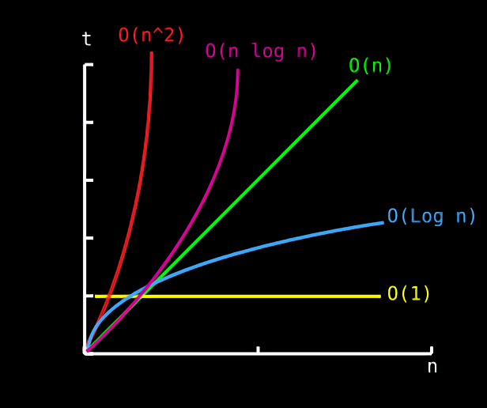

# EcmaScript 6 Algorithms and Data Structures

[](https://travis-ci.org/akhenda/es6-data-structures-and-algorithms)
[](https://codecov.io/gh/akhenda/es6-data-structures-and-algorithms)
[](https://www.codacy.com/app/joseph-akhenda/es6-data-structures-and-algorithms?utm_source=github.com&amp;utm_medium=referral&amp;utm_content=akhenda/es6-data-structures-and-algorithms&amp;utm_campaign=Badge_Grade)
[](https://www.codacy.com/app/joseph-akhenda/es6-data-structures-and-algorithms?utm_source=github.com&utm_medium=referral&utm_content=akhenda/es6-data-structures-and-algorithms&utm_campaign=Badge_Coverage)
[](https://github.com/akhenda/es6-data-structures-and-algorithms/blob/develop/LICENSE) [](http://commitizen.github.io/cz-cli/) [](https://github.com/semantic-release/semantic-release)

This repository contains some popular Data Structures and Algorithms done in JavaScript ES6.

## Data Structures

According to Wikipedia:

> In computer science, a data structure is a particular way of storing and organizing data in a computer so that it can be used efficiently.

The following terms are the foundation terms of a data structure.

*   **Interface** - This represents the set of operation supported by a data structure
*   **Implementation** - This provides the definition of algorithms used in the operations of the data structure i.e. it provides the internal representation of the data structure

### Characteristics of a Data Structure
1.  **Correctness** - a data structure should implement its interface correctly
2.  **Time Complexity** - execution time of operations of a data structure should be as small as possible
3.  **Space Complexity** - memory usage of a data structure operation should be as little as possible

### Data Structure Operations Complexity

| Data Structure          | Access    | Search    | Insertion | Deletion  |
| ----------------------- | :-------: | :-------: | :-------: | :-------: |
| **Array**               | 1         | n         | n         | n         |
| **Stack**               | n         | n         | 1         | 1         |
| **Queue**               | n         | n         | 1         | 1         |
| **Linked List**         | n         | n         | 1         | 1         |
| **Hash Table**          | -         | n         | n         | n         |
| **Binary Search Tree**  | n         | n         | n         | n         |
| **B-Tree**              | log(n)    | log(n)    | log(n)    | log(n)    |
| **AVL Tree**            | log(n)    | log(n)    | log(n)    | log(n)    |


Shown below are the data structures covered here:

-   [Array](src/data-structures/array)
-   [Linked List](src/data-structures/linked-list)
-   [Doubly Linked List](src/data-structures/doubly-linked-list)
-   [Stack](src/data-structures/stack)
-   [Queue](src/data-structures/queue)
-   [Priority Queue](src/data-structures/priority-queue)
-   [Set](src/data-structures/set)
-   [Disjoint Set](src/data-structures/disjoint-set)
-   [Bloom Filter](src/data-structures/bloom-filter)
-   [Skip List](src/data-structures/skip-list)
-   [Hash Table](src/data-structures/hash-table)
-   [Graph](src/data-structures/graph)
-   [Tree](src/data-structures/tree)
-   [Binary Search Tree](src/data-structures/binary-search-tree)
-   [AVL Tree](src/data-structures/avl-tree)
-   [Red Black Tree](src/data-structures/red-black-tree)
-   [Splay Tree](src/data-structures/splay-tree)
-   [B-Tree](src/data-structures/b-tree)
-   [Trie](src/data-structures/trie)
-   [Min Heap](src/data-structures/min-heap)
-   [Max Heap](src/data-structures/max-heap)
-   [Binomial Heap](src/data-structures/binomial-heap)
-   [Fibonacci Heap](src/data-structures/fibonacci-heap)

## Algorithms

This is a process or set of rules to be followed in calculations or other problem-solving operations, especially by a computer.

The following are the algorithms covered here:

### Algorithms by Topic

-   **Searching**
    -   [Linear Search](src/algorithms/searching/linear-search)
    -   [Binary Search](src/algorithms/searching/binary-search)
    -   [Jump/Block Search](src/algorithms/searching/jump-search)
    -   [Interpolation Search](src/algorithms/searching/interpolation-search)
-   **Sorting**
    -   [Shell Sort](src/algorithms/sorting/shell-sort)
    -   [Heap Sort](src/algorithms/sorting/heap-sort)
    -   [Quick Sort](src/algorithms/sorting/quick-sort)
    -   [Radix Sort](src/algorithms/sorting/radix-sort)
    -   [Merge Sort](src/algorithms/sorting/merge-sort)
    -   [Bubble Sort](src/algorithms/sorting/bubble-sort)
    -   [Insertion Sort](src/algorithms/sorting/insertion-sort)
    -   [Counting Sort](src/algorithms/sorting/counting-sort)
    -   [Selection Sort](src/algorithms/sorting/selection-sort)
-   **Sets**
    -   [Longest Increasing Subsequence](src/algorithms/set/longest-increasing-subsequence)
    -   [Longest Common Subsequence](src/algorithms/set/longest-common-subsequence) (LCS)
    -   [Shortest Common Supersequence](src/algorithms/set/shortest-common-supersequence) (SCS)
    -   [Permutations](src/algorithms/set/permutations) (with and without repetitions)
    -   [Combinations](src/algorithms/set/combinations) (with and without repetitions)
    -   [Combination Sum](src/algorithms/set/combination-sum) - find all combinations that form specific sum
    -   [Maximum Subarray](src/algorithms/set/maximum-subarray) - "Brute Force" and "Dynamic Programming" (Kadane's) versions
-   **Math**
    -   [Factorial](src/algorithms/math/factorial)
    -   [Fibonacci](src/algorithms/math/fibonacci)
    -   [Integer Partition](src/algorithms/math/integer-partition)
    -   [Pascal's Triangle](src/algorithms/math/pascals-triangle)
    -   [Least Common Multiple](src/algorithms/math/lcm) (LCM)
    -   [Primality Test](src/algorithms/math/prime-number) (trial division method)
    -   [Euclidean Algorithm](src/algorithms/math/euclidean-algorithm) - calculate the Greatest Common Divisor (GCD)
    -   [Sieve of Eratosthenes](src/algorithms/math/sieve-of-eratosthenes) - finding all prime numbers up to any given limit
    -   [Is Power of Two](src/algorithms/math/is-power-of-two) - check if the number is power of two (naive and bitwise algorithms)
-   **Trees**
    -   [Depth-First Search (DFS)](src/algorithms/tree/depth-first-search)
    -   [Breadth-First Search (BFS)](src/algorithms/tree/breadth-first-search)
-   **Graphs**
    -   [Depth-First Search (DFS)](src/algorithms/graph/depth-first-search)
    -   [Breadth-First Search (BFS)](src/algorithms/graph/breadth-first-search)
    -   [Dijkstra Algorithm](src/algorithms/graph/dijkstra-algorithm) - finding shortest paths to all graph vertices from single vertex
    -   [Prim’s Algorithm](src/algorithms/graph/prims-algorithm) - finding Minimum Spanning Tree (MST) for weighted undirected graph
    -   [Kruskal’s Algorithm](src/algorithms/graph/kruskals-algorithm) - finding Minimum Spanning Tree (MST) for weighted undirected graph
    -   [Travelling Salesman Problem](src/algorithms/graph/travelling-salesman) - shortest possible route that visits each city and returns to the origin city
-   **Others**
    -   [Tower of Hanoi](src/algorithms/others/tower-of-hanoi)

### Algorithms by Paradigm

An algorithmic paradigm is a generic method or approach which underlies the design of a class of algorithms. It is an abstraction higher than the notion of an algorithm, just as an algorithm is an abstraction higher than a computer program.

-   **Brute Force** - look at all the possibilities and selects the best solution
    -   [Linear Search](src/algorithms/searching/linear-search)
    -   [Maximum Subarray](src/algorithms/set/maximum-subarray)
    -   [Travelling Salesman Problem](src/algorithms/graph/travelling-salesman) - shortest possible route that visits each city and returns to the origin city
-   **Greedy** - choose the best option at the current time, without any consideration for the future
    -   [Prim’s Algorithm](src/algorithms/graph/prims-algorithm) - finding MST for weighted undirected graph
    -   [Dijkstra Algorithm](src/algorithms/graph/dijkstra-algorithm) - finding shortest path to all graph vertices
    -   [Kruskal’s Algorithm](src/algorithms/graph/kruskals-algorithm) - finding Minimum Spanning Tree (MST) for weighted undirected graph
-   **Divide and Conquer** - divide the problem into smaller parts and then solve those parts
    -   [Quick Sort](src/algorithms/sorting/quick-sort)
    -   [Merge Sort](src/algorithms/sorting/merge-sort)
    -   [Binary Search](src/algorithms/searching/binary-search)
    -   [Tower of Hanoi](src/algorithms/others/tower-of-hanoi)
    -   [Pascal's Triangle](src/algorithms/math/pascals-triangle)
    -   [Euclidean Algorithm](src/algorithms/math/euclidean-algorithm) - GCD
    -   [Tree Depth-First Search](src/algorithms/tree/depth-first-search) (DFS)
    -   [Graph Depth-First Search](src/algorithms/graph/depth-first-search) (DFS)
    -   [Permutations](src/algorithms/set/permutations) (with and without repetitions)
    -   [Combinations](src/algorithms/set/combinations) (with and without repetitions)
-   **Dynamic Programming** - build up a solution using previously found sub-solutions
    -   [Fibonacci](src/algorithms/math/fibonacci)
    -   [Integer Partition](src/algorithms/math/integer-partition)
    -   [Maximum Subarray](src/algorithms/set/maximum-subarray)
    -   [Longest Increasing Subsequence](src/algorithms/set/longest-increasing-subsequence)
    -   [Shortest Common Supersequence](src/algorithms/set/shortest-common-supersequence)
    -   [Longest Common Subsequence](src/algorithms/set/longest-common-subsequence) (LCS)
-   **Backtracking** - similarly to brute force, try to generate all possible solutions, but each time you generate next solution you test if it satisfies all conditions, and only then continue generating subsequent solutions. Otherwise, backtrack, and go on a different path of finding a solution. Normally the DFS traversal of state-space is being used.
    -   [Combination Sum](src/algorithms/set/combination-sum) - find all combinations that form specific sum


### Array Sorting Algorithms Complexity

| Name                  | Best            | Average             | Worst               | Memory    | Stable    |
| --------------------- | :-------------: | :-----------------: | :-----------------: | :-------: | :-------: |
| **Bubble sort**       | n               | n<sup>2</sup>       | n<sup>2</sup>       | 1         | Yes       |
| **Insertion sort**    | n               | n<sup>2</sup>       | n<sup>2</sup>       | 1         | Yes       |
| **Selection sort**    | n<sup>2</sup>   | n<sup>2</sup>       | n<sup>2</sup>       | 1         | No        |
| **Heap sort**         | n&nbsp;log(n)   | n&nbsp;log(n)       | n&nbsp;log(n)       | 1         | No        |
| **Merge sort**        | n&nbsp;log(n)   | n&nbsp;log(n)       | n&nbsp;log(n)       | n         | Yes       |
| **Quick sort**        | n&nbsp;log(n)   | n&nbsp;log(n)       | n<sup>2</sup>       | log(n)    | No        |
| **Shell sort**        | n&nbsp;log(n)   | depends on gap sequence   | n&nbsp;(log(n))<sup>2</sup>  | 1         | No         |
| **Counting sort**     | n + r           | n + r               | n + r               | n + r     | Yes       |
| **Radix sort**        | n * k           | n * k               | n * k               | n + k     | Yes       |


## Big-O Notation

This is a theoretical measure of the execution of an algorithm, usually the time or memory needed, given the problem size **n**, which is usually the number of items. Informally, saying some equation `f(n) = O(g(n))` means it is less than some constant multiple of `g(n)`.

It is used in Computer Science to describe the performance or complexity of an algorithm. Big-O specifically describes the worst-case scenario, and can be used to describe the execution time required or the space used (e.g. in memory or on disk) by an algorithm.

The most optimum algorithm scales in *constant* time and space. This means it does not care at all about the growth of its inputs. Next best is *logarithmic* time or space, then *linear*, *linearithmic*, *quadratic*, and *exponential*. The worst is *factorial* time or space. In **Big-O** notation:

1.  **Constant:** O(1)
2.  **Logarithmic:** O(log n)
3.  **Linear:** O(n)
4.  **Linearithmic:** O(n log n)
5.  **Quadratic:** O(n²)
6.  **Expontential:** O(2^n)
7.  **Factorial:** O(n!)

Below is the list of some of the most used Big O notations and their performance comparisons against different sizes of the input data.

| Big O Notation | Computations for 10 elements | Computations for 100 elements | Computations for 1000 elements  |
| -------------- | ---------------------------- | ----------------------------- | ------------------------------- |
| **O(1)**       | 1                            | 1                             | 1                               |
| **O(log N)**   | 3                            | 6                             | 9                               |
| **O(N)**       | 10                           | 100                           | 1000                            |
| **O(N log N)** | 30                           | 600                           | 9000                            |
| **O(N^2)**     | 100                          | 10000                         | 1000000                         |
| **O(2^N)**     | 1024                         | 1.26e+29                      | 1.07e+301                       |
| **O(N!)**      | 3628800                      | 9.3e+157                      | 4.02e+2567                      |



## Installation

Clone this repo:

```
$ git clone https://github.com/akhenda/es6-data-structures-and-algorithms.git
```

Navigate to the `es6-data-structures-and-algorithms` directory:

```
$ cd es6-data-structures-and-algorithms
```

Install the required dependencies:

```
$ yarn install
```

## Testing

To run both tests and linting, run:

```
yarn run validate
```

To run the tests alone:

```
yarn run test
```

To run ESLint:

```
yarn run lint
```

## Usage

...


## Resources

-   [Javascript Algorithms - Oleksii Trekhleb](https://github.com/trekhleb/javascript-algorithms)
-   [Data Structures and Algorithms Playlist on Youtube](https://www.youtube.com/playlist?list=PLLXdhg_r2hKA7DPDsunoDZ-Z769jWn4R8)

## License

### The MIT License (MIT)

Copyright (c) 2016 [Joseph Akhenda](https://github.com/akhenda).

> Permission is hereby granted, free of charge, to any person obtaining a copy
> of this software and associated documentation files (the "Software"), to deal
> in the Software without restriction, including without limitation the rights
> to use, copy, modify, merge, publish, distribute, sublicense, and/or sell
> copies of the Software, and to permit persons to whom the Software is
> furnished to do so, subject to the following conditions:
>
> The above copyright notice and this permission notice shall be included in
> all copies or substantial portions of the Software.
>
> THE SOFTWARE IS PROVIDED "AS IS", WITHOUT WARRANTY OF ANY KIND, EXPRESS OR
> IMPLIED, INCLUDING BUT NOT LIMITED TO THE WARRANTIES OF MERCHANTABILITY,
> FITNESS FOR A PARTICULAR PURPOSE AND NONINFRINGEMENT. IN NO EVENT SHALL THE
> AUTHORS OR COPYRIGHT HOLDERS BE LIABLE FOR ANY CLAIM, DAMAGES OR OTHER
> LIABILITY, WHETHER IN AN ACTION OF CONTRACT, TORT OR OTHERWISE, ARISING FROM,
> OUT OF OR IN CONNECTION WITH THE SOFTWARE OR THE USE OR OTHER DEALINGS IN
> THE SOFTWARE.
